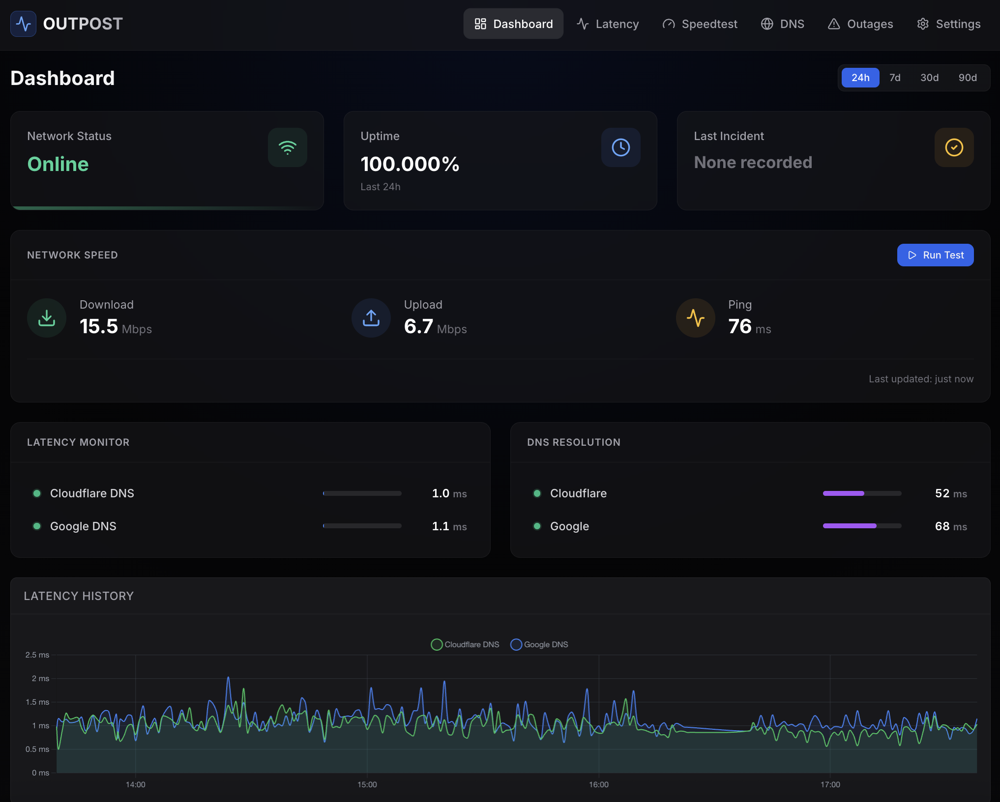

# Outpost - Home Network Health Monitor

A Docker-based network health monitoring solution that tracks internet connectivity, speed, latency, and DNS health through an intuitive web dashboard.

## Features

- **Latency Monitoring**: ICMP ping to configurable targets (Google DNS, Cloudflare DNS, custom hosts)
- **Speedtest Monitoring**: Periodic download/upload speed measurements
- **DNS Health**: Query resolution time and failure detection
- **Outage Tracking**: Automatic detection with precise start/end times
- **Web Dashboard**: Clean, responsive interface with real-time charts
- **Data Retention**: Configurable retention period (default: 90 days)
- **SQLite Storage**: Single-file database, no external dependencies

## Screenshot



## Quick Start

### Using Docker Compose (Recommended)

```bash
# Clone or navigate to the repository
cd outpost

# Start the application
docker compose up -d

# View logs
docker compose logs -f outpost

# Stop the application
docker compose down
```

The application will be available at `http://localhost:3000`

### Using Docker Build

```bash
# Build the image
docker build -t outpost .

# Run the container
docker run -d \
  --name outpost \
  --network host \
  -v outpost_data:/data \
  -e OUTPOST_PORT=3000 \
  -e OUTPOST_RETENTION_DAYS=90 \
  outpost
```

### Bridge Network Mode

If you prefer not to use host network mode, use the bridge configuration:

```bash
docker compose -f docker-compose.bridge.yml up -d
```

Note: Bridge network mode may slightly affect latency measurements.

## Configuration

### Environment Variables

- `OUTPOST_PORT`: Server port (default: 3000)
- `OUTPOST_DATA_DIR`: Data directory path (default: /data)
- `OUTPOST_PING_INTERVAL`: Ping interval in seconds (default: 60)
- `OUTPOST_SPEEDTEST_INTERVAL`: Speedtest interval in hours (default: 1)
- `OUTPOST_DNS_INTERVAL`: DNS check interval in seconds (default: 300)
- `OUTPOST_RETENTION_DAYS`: Data retention period (default: 90)

### Configuration File

The application creates a configuration file at `/data/config.json` which can be modified through the web interface at `/settings` or manually.

Default configuration:
```json
{
  "monitors": {
    "ping": {
      "enabled": true,
      "intervalSeconds": 60,
      "targets": [
        { "host": "8.8.8.8", "name": "Google DNS" },
        { "host": "1.1.1.1", "name": "Cloudflare DNS" }
      ]
    },
    "speedtest": {
      "enabled": true,
      "intervalHours": 1
    },
    "dns": {
      "enabled": true,
      "intervalSeconds": 300,
      "servers": [
        { "address": "8.8.8.8", "name": "Google" },
        { "address": "1.1.1.1", "name": "Cloudflare" }
      ],
      "testDomains": ["google.com", "cloudflare.com"]
    }
  },
  "retention": {
    "days": 90
  }
}
```

## Web Interface

### Dashboard (`/`)
- Current network status
- Latest speedtest results
- Real-time latency for all targets
- DNS health indicators
- Latency history chart

### Latency (`/latency`)
- Detailed latency charts over time
- Per-target statistics (success rate, avg/min/max latency, packet loss)

### Speedtest (`/speedtest`)
- Speed history charts (download/upload)
- Manual speedtest trigger
- Individual test results with timestamps

### DNS (`/dns`)
- Per-server health cards
- Query response times
- Recent query history

### Outages (`/outages`)
- Active outage alerts
- Historical outage timeline
- Uptime percentage
- Total downtime statistics

### Settings (`/settings`)
- Configure monitor intervals
- Add/remove ping targets
- Add/remove DNS servers
- Set data retention period

## API Endpoints

### Metrics
- `GET /api/ping` - Get ping results
- `GET /api/ping/latest` - Latest ping per target
- `GET /api/speedtest` - Get speedtest results
- `GET /api/speedtest/latest` - Latest speedtest
- `GET /api/dns` - Get DNS query results
- `GET /api/dns/latest` - Latest DNS per server
- `GET /api/outages` - Get outage records
- `GET /api/stats?period=24h` - Aggregated statistics

### Actions
- `POST /api/speedtest/run` - Trigger manual speedtest
- `GET /api/speedtest/run/:id` - Check speedtest job status
- `GET /api/status` - Current outage status

### Configuration
- `GET /api/config` - Get current configuration
- `PATCH /api/config` - Update configuration
- `POST /api/config/reset` - Reset to defaults

### Health
- `GET /api/health` - Health check endpoint

## Data Storage

All data is stored in a single SQLite database at `/data/outpost.db`.

### Tables
- `ping_results` - Latency measurements
- `speedtest_results` - Speed test results
- `dns_results` - DNS query results
- `outages` - Outage records

### Backup

To backup your data:
```bash
docker cp outpost:/data/outpost.db ./backup.db
```

To restore:
```bash
docker cp ./backup.db outpost:/data/outpost.db
docker compose restart
```

## Development

### Prerequisites
- Node.js 20+
- npm

### Local Development

```bash
# Install dependencies
npm install

# Run backend and frontend in development mode
npm run dev

# Backend will run on http://localhost:3000
# Frontend will run on http://localhost:3001
```

### Build

```bash
# Build frontend for production
npm run build

# Start production server
npm start
```

## Architecture

### Backend
- **Runtime**: Node.js 20
- **Framework**: Fastify
- **Database**: better-sqlite3
- **Scheduler**: node-cron
- **Monitoring**: ping, speedtest-cli, native DNS

### Frontend
- **Framework**: Next.js 14+ with App Router
- **UI**: React 19
- **Styling**: Tailwind CSS
- **Charts**: Chart.js with react-chartjs-2

## Troubleshooting

### Container keeps restarting
```bash
docker compose logs outpost
```
Check for errors in the logs. Common issues:
- Port already in use
- Insufficient permissions for ICMP ping
- Data directory permissions

### Speedtest not working
Speedtest requires:
- Working internet connection
- NET_RAW capability (automatic with host network mode)
- speedtest-cli package installed

Note: scheduled speedtests run at a random minute offset past the hour, not at
:00 exactly. Speedtest.net rate-limits the server-list endpoint at the top of
the hour (when every cron-scheduled client in the world fires at once), which
makes tests scheduled at :00 fail with "Unable to connect to servers to test
latency". Failed runs are retried up to 3 times with backoff, and the failure
reason is stored with each result.

### No data showing up
Wait a few minutes for the monitors to run their first checks. Default intervals:
- Ping: Every 60 seconds
- DNS: Every 5 minutes
- Speedtest: Every 1 hour

## License

MIT License

## Version

1.0.0
